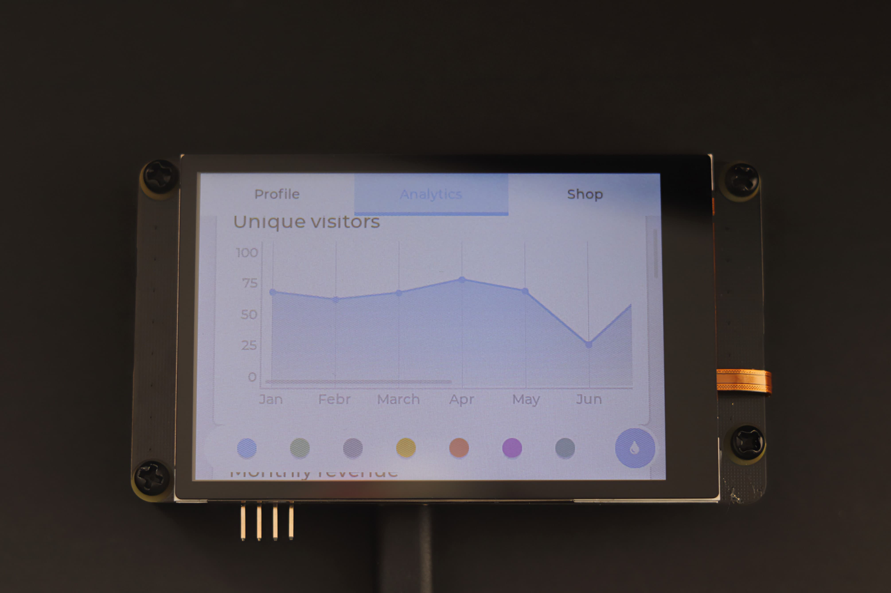

# Pico_DM_QD3503728 Template

This is a template project that you can use to port various GUI libraries, such as lvgl.

## Getting started

Here is an example showing how to invoke the display function.

```c
#include "ili9488.h"

    ili9488_driver_init();
    
    /* void ili9488_fill(uint16_t color); */
    ili9488_fill(0x0000);

#define CUBE_X_SIZE (LCD_HOR_RES / 3 * 2)
#define CUBE_Y_SIZE (LCD_VER_RES / 3 * 2)
    static uint16_t video_memory[CUBE_X_SIZE * CUBE_Y_SIZE] = {0};
    memset(video_memory, (rand() % 255), sizeof(video_memory));
    
    /* void ili9488_video_flush(int xs, int ys, int xe, int ye, void *vmem16, uint32_t len); */
    ili9488_video_flush(
        LCD_HOR_RES / 2 - (CUBE_X_SIZE / 2),
        LCD_VER_RES / 2 - (CUBE_Y_SIZE / 2),
        LCD_HOR_RES / 2 + (CUBE_X_SIZE / 2) - 1,
        LCD_VER_RES / 2 + (CUBE_Y_SIZE / 2) - 1,
        video_memory, sizeof(video_memory)
    );
```

And of course, touch.

```c
#include "ft6236.h"

ft6236_driver_init();

/* 
 * bool ft6236_is_pressed(void);
 * uint16_t ft6236_read_x(void);
 * uint16_t ft6236_read_y(void);
 */
if (ft6236_is_pressed())
    printf("pressed at (%d, %d)\n", ft6236_read_x(), ft6236_read_y());
```

### Technical specifications
| Part | Model |
| --- | --- |
| Core Board | Rasberrypi Pico |
| Display | 3.5' 480x320 ILI9488 no IPS |
| | 16-bit 8080 50MHz |
| TouchScreen | 3.5' FT6236 capacity touch |

### Pinout

| Left | Right |
| --- | --- |
| GP0/DB0 | VBUS |
| GP1/DB1 | VSYS |
| GND | GND |
| GP2/DB2 | 3V3_EN |
| ... | ... |

GP0 ~ GP15 -> ILI9488 16 DB0-DB15 pins
GP18 -> ILI9488 CS (Chip select)
GP19 -> ILI9488 WR (write signal)
GP20 -> ILI9488 RS (Register select, Active Low, 0: cmd, 1: data)
GP22 -> ILI9488 Reset (Active Low)
GP28 -> IlI9488 Backlight (Active High)



